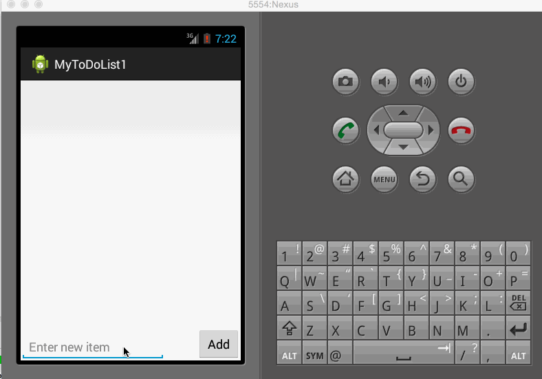

This is a simple Todo App. The functionanity it covers are:
   - Adding a Todo Item.
   - Deleting an existing Todo Item.
   - The Todo Items are get stored as well so that when the App gets started it brings back the existing Todo Items.

NOTE:
It won't allow to add empty items.

For demo I have created a GIF file.

